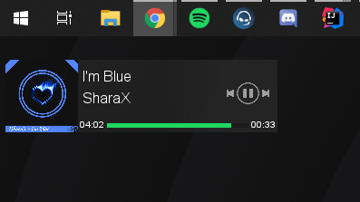
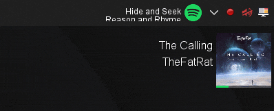

# Spotify Addon
A module to display the current running Spotify song. 

It will show the track cover, track title and artist with progress on top of the image. 
You can hover with your mouse over the image to extend the module with a detailed progress bar
and control buttons.

### Supported features:
- Track title & artist
- Track progress & length
- Playing state
- Track cover
- Previous song, play/pause & next song buttons

*Currently only available for Windows*

### Lyrics
This addon has an additional module that displays the lyrics to the song.

##### The currently supported lyrics sources are
- https://crintsoft.com/
- http://music.163.com/

## Installation
This addon requires the core application [DesktopModules](https://github.com/LabyStudio/desktopmodules)

You can download the addon jar file [here](https://github.com/LabyStudio/spotify-addon/releases/)  
Put the built jar file into the following directory: ``C:/Users/<name>/AppData/Roaming/DesktopModules/addons/`` 
And then you are ready to launch the core application.

## Run in IDE
Launch the main class ``StartSpotify``